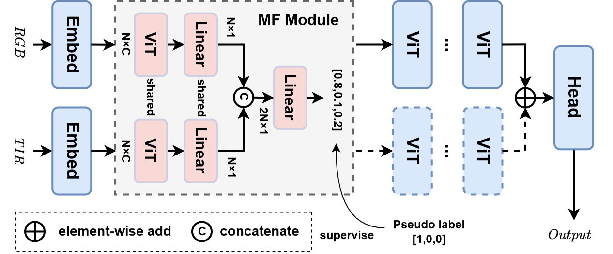
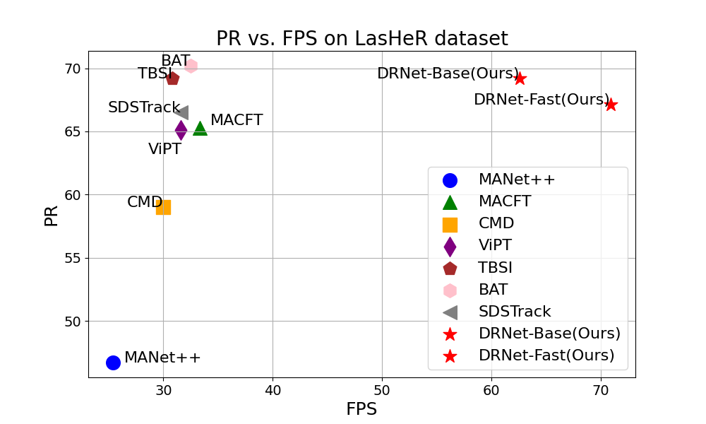
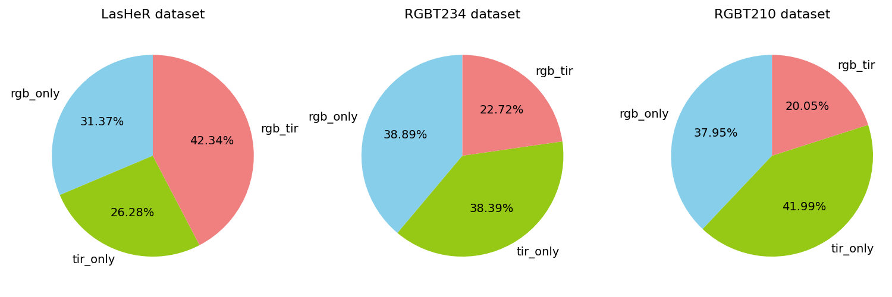
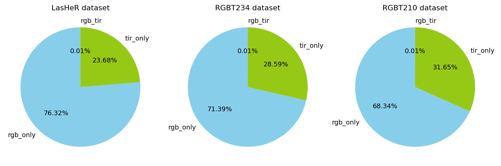
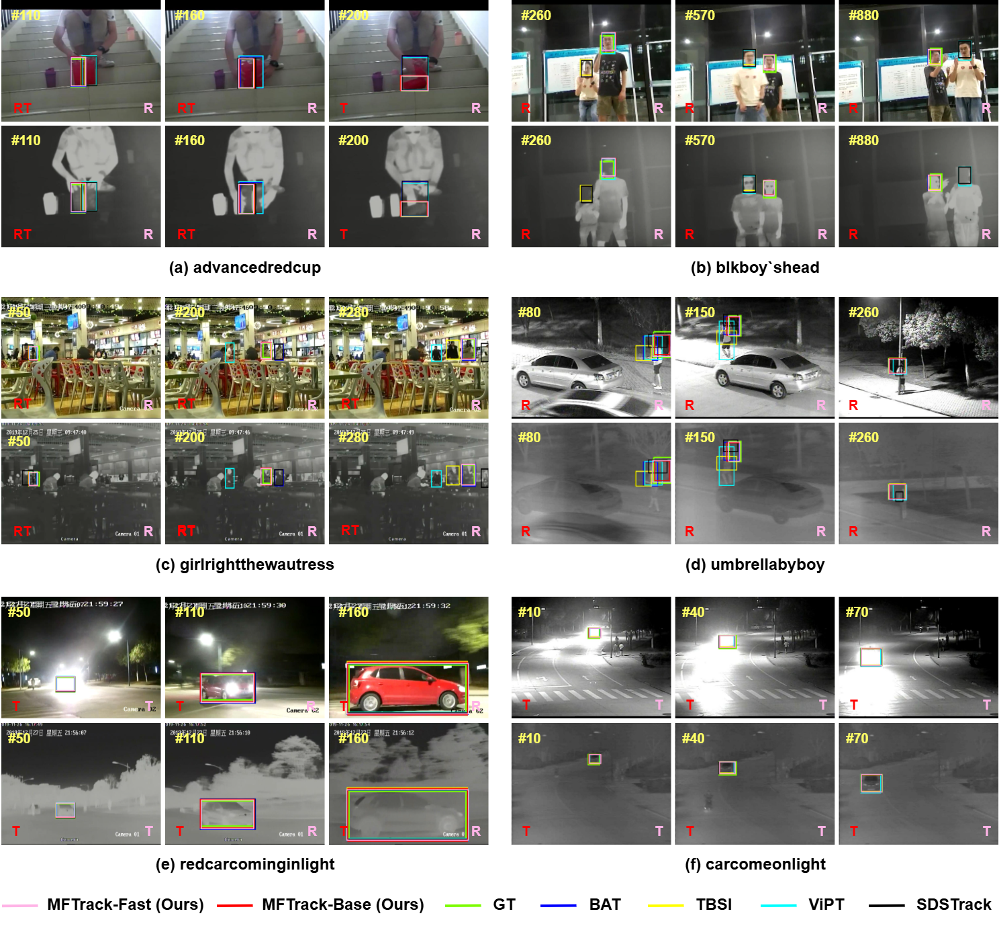
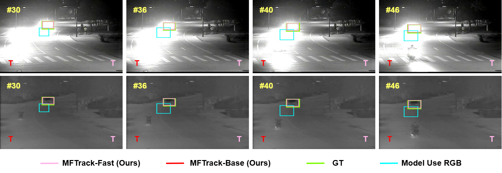
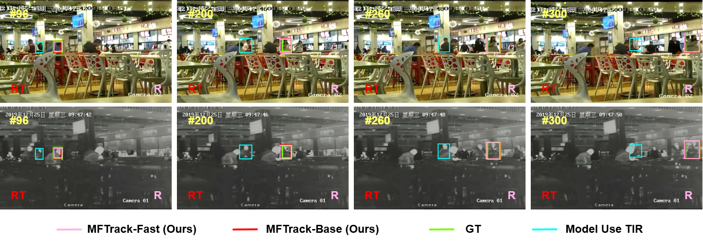

# DRNet

The official implementation for the 2025 paper Dynamic Reduction Network for Resource-Efficient RGBT Tracking

# Highlights

## Good performance-speed trade-off

PR vs. FPS on LasHeR dataset. Our method significantly enhances inference speed and conserves computational resources while maintaining tracking accuracy.

# Visualization

Visualization of modality usage across three RGBT datasets for the DRNet-Base model. The bright coral-colored sections indicate no early exit of modalities, the light green sections represent the usage of only the TIR modality, and the sky blue sections signify the usage of only the RGB modality.

Visualization of modality usage across three RGBT datasets for the DRNet-Fast model.

Qualitative comparison between our method and other RGBT trackers on four representative sequences from LasHeR dataset. The green bounding boxes denote ground truth. In each frame of the image, the red marker in the lower left corner indicates the modality usage of DRNet-Base, while the pink marker in the lower right corner represents the modality usage of DRNet-Fast. Specifically, RT, R, and T denote the utilization of both RGB and TIR modalities, the exclusive use of the RGB modality, and the exclusive use of the TIR modality, respectively.

Visualization of tracking results for DRNet-Base model, DRNet-Fast model, and model using only RGB modality.

Visualization of tracking results for DRNet-Base model, DRNet-Fast model, and model using only TIR modality.